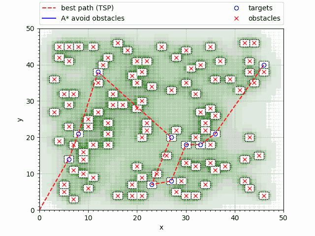

## Path-planning algorithm for the CPS course, HiPEDs Imperial 2017
(fork of my code from a team project)

The task was to create teams to control a crane robot for avoiding obstacles, in pre-defined object courses. This is my path planning algorithm. My contribution to the team project was this code.

There are 2 python files. One generates courses according to the specifications and the other one solves it and creates a visualisation of the solution.

The solve_course_csv.py file, implements the Held-Karp algorithm and A*. The Held-Karp algorithm is used upon the targets only and then A* search is used to avoid the obstacles. This combination is fast for our purposes, but since the obstacles could change the travel distance between the targets, there are small probability for going over a target twice. It also uses a heatmap as a part for the heuristic to avoid being too close to obstacles.

